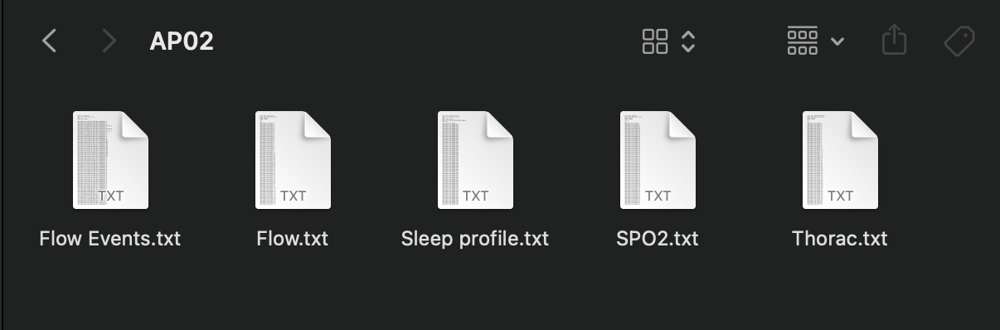
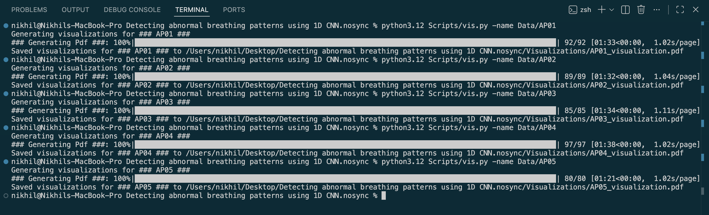
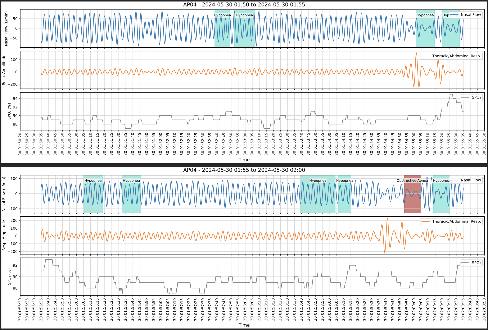
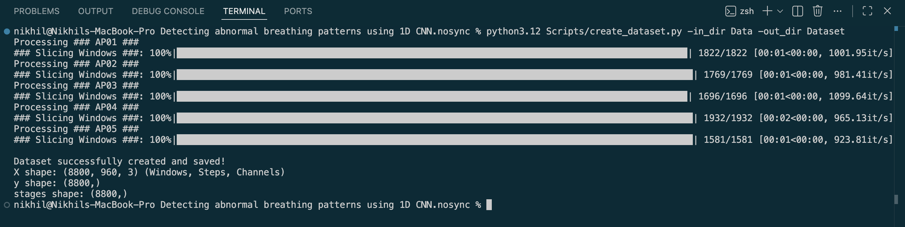
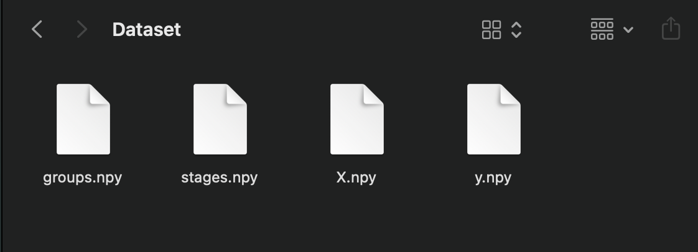
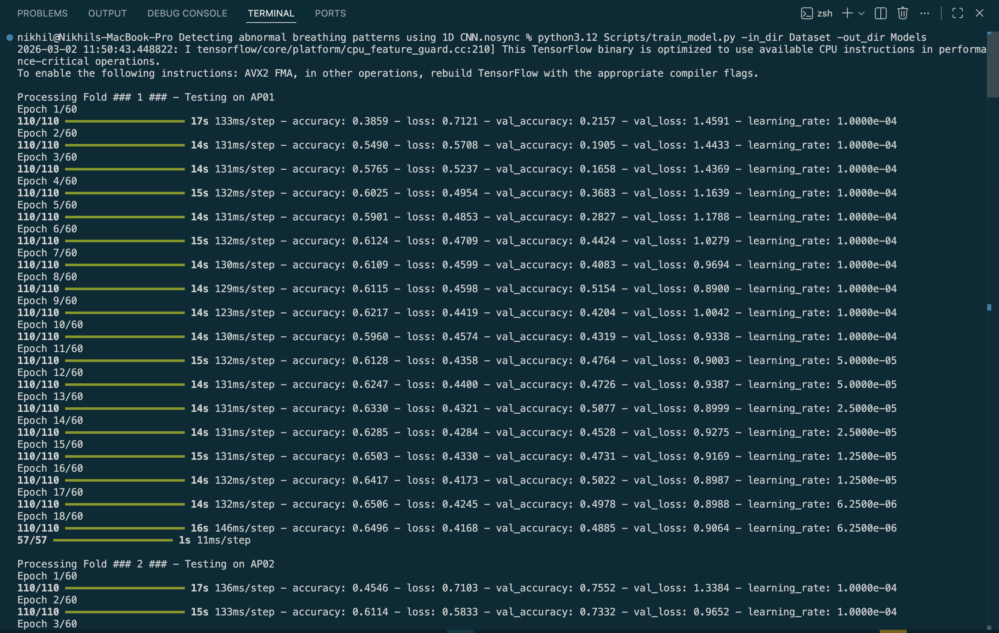
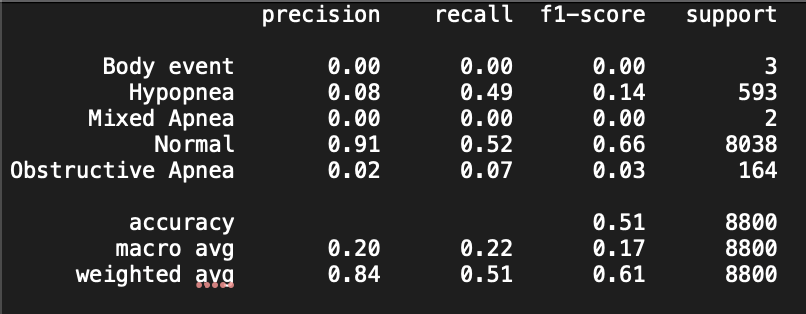
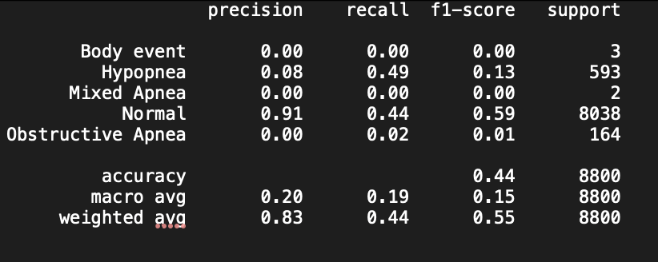

# Detecting-Abnormal-Breathing-Patterns-using-1D-CNNs
## AI for Healthcare
This project focuses on detecting abnormal breathing patterns by feeding time series data such as Nasal Flow, Thoracic movements and SPO₂ into 1D CNNs. It also explores the effect of changing parameters such as Learning Rates and number of epochs on Accuracy and Precision.

### Phase 1 : Data Cleaning and Visualization
The image below shows the general structure of the data of individual participants.

This data is loaded, cleaned and then plotted for visualization.

The vis.py file finishes its execution-

Sample of the graphs generated-

### Phase 2 : Dataset Creation
Once the data is visualized and understood, it is converted into a dataset usable for ML Models-
The create_dataset.py file finishes execution-

Once done, the program saves the dataset in the format given below-

Now, we are ready to train our models on this dataset.
The Model is trained- 

I trained multiple models tweaking certain parameters here and there while analyzing the outputs

The below image shows the report of the cnn model with the GlobalAveragePooling1D layer

The below image shows the report of the cnn model with the Bidirectional(LSTM(64)) layer. Perhaps using a bigger dataset might have improved the results.

